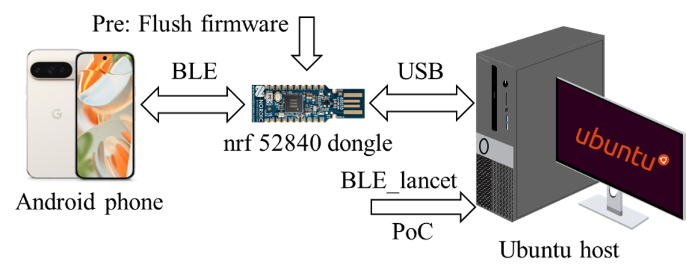

# Structure of this folder
- `./Attack` Files for implementing the PE confusion attack.
- `./ExpCode` // Formal models
- `./ExpRun` // Scripts for verifying models and crawling attack graphs
- `./relaxedAssumption` // Models with relaxed assumptions and verification results for them


# Prepare
Download the docker image `tamarin-container_1.8.0.tar` from the following link and cope it to folder `./ExpRun/files/`.
- Link to docker image: https://drive.filen.io/d/004b7e20-bfcc-4cc7-b00d-be6a83c491bd#Hw5mfgqslPmVweIhCtyWWUtzCEkgd6Ft

You should config the `./ExpRun/servers.json` with your servers equipped with docker.
The user in these servers should have permissions to create docker containers.


# Verifying Models and Crawling Attack Graph
The verification scripts are executed in Ubuntu 24.04.
``` shell
apt install make m4 python3.12-venv
python -m venv myenv
pip install requirements.txt
make all
```
The last command will automatically verify 84 models for all pairing cases and crawl attack graph once finishing.
It is important to note that it takes several weeks to verify these models.
(5 days for total 20 docker containers on 6 servers)

# Results
The verification results are listed in the following anonymous link.
- Results: https://drive.filen.io/d/acaf1c69-a587-4b18-9b3b-1eea87dfdbc1#Kby607qruJelRAGP1fsfErf1NZDmS46W

The attack graphs are listed in the following anonymous link.
- Attack graphs: https://drive.filen.io/d/c1be86c4-2540-44e3-ba5c-0e662c223dd1#28Y2GqSbuZWc7exubjmpWSyDzSUvyZel

# Attack
The controlled attack environment is shown in the following picture.

The subfolder `./Attack` contains the firmware for the nrf-52840 dongle, the MitM tool `ble_lancet`, the PoCs, and the required python libraries.